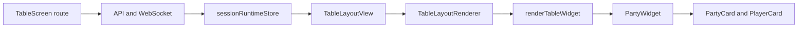

# TV screen and player card system — UI analysis

This document reverse-engineers how the table/TV display and player cards work in the DnD monorepo: rendering, data flow, layout, builder, themes, and current customization limits.

**Primary code paths:** `apps/frontend` (React), `packages/shared-types`, `apps/backend` (session + WebSocket).

---

## Architecture overview

### Rendering flow

1. **Route:** The TV/table display is served by [`apps/frontend/src/pages/TableScreen.tsx`](apps/frontend/src/pages/TableScreen.tsx). It resolves `displayToken` from the URL, fetches display meta and `PublicSessionState`, optionally gates on a PIN or account unlock, then subscribes to live updates via `useSessionSocket`.
2. **Layout shell:** `TableScreen` renders [`TableLayoutView`](apps/frontend/src/components/TableLayoutView.tsx), which delegates to [`TableLayoutRenderer`](apps/frontend/src/layout/TableLayoutRenderer.tsx).
3. **Widgets:** `TableLayoutRenderer` reads `state.tableLayout` (or default), sorts widgets, projects optional `layoutV2` into legacy grid coordinates, and for each widget calls [`renderTableWidget`](apps/frontend/src/widgets/renderTableWidget.tsx), which looks up the component in `WIDGET_REGISTRY` and renders it inside a themed grid cell.
4. **Party → cards:** The `party` widget is [`PartyWidget`](apps/frontend/src/widgets/PartyWidget.tsx). For full-size TV cards it maps each `NormalizedCharacter` through [`PartyCard`](apps/frontend/src/components/PartyCard.tsx) → [`PlayerCard`](apps/frontend/src/components/player-card/PlayerCard.tsx).

### Data flow

- **Authoritative state:** [`PublicSessionState`](packages/shared-types/src/session.ts) includes `tableLayout`, `party`, `partyCardDisplay`, `theme`, `themePalette`, initiative, effects, dice log, etc.
- **Bootstrap:** `GET /api/public/display/:token` (and meta) hydrate the display client; WebSocket keeps `publicSession` in sync.
- **DM-driven updates:** Table layout and session fields are updated from the Master Console / DM settings via `emit('session:setTableLayout', …)` and REST `PATCH` on the session; the backend persists and broadcasts.

### Builder flow

- [`TableLayoutEditor`](apps/frontend/src/layout/TableLayoutEditor.tsx) holds a **draft** copy of `tableLayout`, syncs from server when widget fingerprints change, and previews widgets with the same `fillCell` behavior as the TV.
- **Apply** runs `normalizeTableLayout` + `validateTableLayoutForServer`, then `onApply(layout)` — from [`MasterConsole`](apps/frontend/src/pages/MasterConsole.tsx) this emits `session:setTableLayout`.
- **Revert** reloads the draft from current `state.tableLayout`.

---

## Player card structure

### Components

| Layer | Role |
|-------|------|
| `PartyWidget` | Chooses TV layout mode (`full`, `compact`, `combined`, `customFull`), party grid density, fit-zoom container, initiative masking on display. |
| `PartyCard` | Wraps each character in `ThemedPanel`, maps `NormalizedCharacter` → `PlayerCardData`, optional DM-only controls (HP inputs, absent checkbox). |
| `PlayerCard` | Pure presentation: ordered vertical **sections** driven by `PartyCardDisplayOptions` and `PlayerCardSectionId`. |
| `components/player-card/*` | Badges and shells (e.g. AC shield, spell save book) used inside section renderers. |

### Data mapping

- **Input:** `NormalizedCharacter` from `state.party.characters` (plus avatar fallback logic tied to initiative where applicable).
- **Adapter:** [`normalizedCharacterToPlayerCardData`](apps/frontend/src/components/player-card/mapPlayerCardData.ts) produces [`PlayerCardData`](apps/frontend/src/components/player-card/types.ts): name, avatar, HP, AC, initiative mod, passives, conditions, spell slots, class resources, optional combat fields, etc.

### Section composition and positioning

- Sections are a **fixed catalog** (`header`, `primaryStats`, `movement`, `abilities`, `savingThrows`, `senses`, `classSummary`, `spellSlots`, `conditions`) defined in [`party-card-display.ts`](packages/shared-types/src/party-card-display.ts).
- **Order:** `effectivePlayerCardSectionOrder(options)` — DM can reorder via `sectionOrder` in `PartyCardDisplayOptions`.
- **Visibility:** Each section’s render function checks booleans on `PartyCardDisplayOptions` (show avatar, show HP bar, show abilities, etc.).
- **Internal layout:** Mostly **flex** and **CSS grid** (e.g. primary stats row uses responsive `grid-cols-*`), with **computed scale** from `playerCardScale(large, tvDensity)` — Tailwind class strings for typography, padding, icon frames.
- **Header edge cases:** Character name uses `useLayoutEffect` + `ResizeObserver` to shrink font size to fit width / avatar height.

### TV-specific behavior

- **`tvDensity`:** `cozy` \| `compact` \| `dense` from party size ([`tvPartyGridDensityFromCount`](apps/frontend/src/components/player-card/types.ts)), tightened when the party widget’s grid cell is small ([`tightenPartyDensityForGridCell`](apps/frontend/src/components/player-card/types.ts)) and when `fillCell` + short viewport.
- **`useFitContentZoom`:** When the party widget fills a bounded TV cell, content can be scaled down with CSS `zoom` (min ~0.52) so the grid fits vertically — see [`useFitContentZoom.ts`](apps/frontend/src/hooks/useFitContentZoom.ts).

### Alternate party views (not the full `PlayerCard` tree)

- **Compact / combined / customFull:** [`TvPartyCompactTile`](apps/frontend/src/widgets/TvPartyCompactTile.tsx), [`TvPartyCombinedColumn`](apps/frontend/src/widgets/TvPartyCombinedColumn.tsx), and widget `config` driven types in [`widget-config.ts`](packages/shared-types/src/widget-config.ts) (e.g. `combinedLayout`, block scales, `decorSvg`). These reuse themes and some glyphs but are **separate layout systems** from the monolithic `PlayerCard` section stack.

---

## Layout system breakdown

### Table-level grid (widgets)

- **Mechanism:** CSS `display: grid` with **12 columns** (`.table-layout-grid` in [`index.css`](apps/frontend/src/index.css)). Each widget cell uses inline `gridColumn` / `gridRow` from `WidgetInstance.x, y, w, h`.
- **Fill viewport (TV):** `.table-layout-grid--fill` + `gridTemplateRows: repeat(rowCount, minmax(0, 1fr))` so rows divide height; cells are flex columns with **overflow scroll** on the inner wrapper (`TableLayoutRenderer`, `fillViewport` prop from `TableScreen`).
- **Row count:** `tableLayoutRowCount(widgets)` — derived from max `y + h`, minimum 1 ([`tableLayoutGrid.ts`](apps/frontend/src/layout/tableLayoutGrid.ts)).

### `layoutV2` vs legacy grid

- Legacy fields `x, y, w, h` are the **canonical grid placement** the renderer consumes.
- Optional [`WidgetLayoutV2`](apps/frontend/src/layout/layoutV2.ts) (`xPct`, `yPct`, `wPct`, `hPct`, `anchorX`, `anchorY`) lives under `widget.config.layoutV2`.
- **Pipeline:** `getWidgetLayoutV2` merges stored v2 with legacy-derived defaults; `layoutV2ToLegacyGrid` **rounds** back to integer cells for CSS grid; `withWidgetLayoutV2Config` persists v2 on the widget. The editor’s “free” move mode updates percentages and anchors, then reprojects to `x,y,w,h`.

### Party widget internal grid

- **Full TV:** `grid-cols-3` with gap classes depending on `tvDensity` (`PartyWidget`).
- **Compact:** Higher column counts at larger breakpoints (`grid-cols-4` …).
- **Combined:** Initiative-ordered columns with per-block config — not the same as the 12-column table grid.

### Responsive behavior

- Below **1024px**, `.table-layout-grid` collapses to a **single column** and forces `grid-column: 1 / -1` and `grid-row: auto` on cells — TV layout positions are not preserved on narrow viewports.
- Layout editor uses `.table-layout-editor-canvas` to **keep** 12 columns on narrow browsers for editing.

---

## Theme system breakdown

### Session theme and palette

- **`theme`:** A `TableTheme` id (`minimal`, `fantasy`, …) from shared types.
- **`themePalette`:** Optional `string[]` of hex colours; mapped to semantic CSS variables via [`mapPaletteToTheme`](apps/frontend/src/theme/mapPaletteToTheme.ts).

### How styles apply

1. **Root:** [`applySessionVisualTheme`](apps/frontend/src/theme/tableTheme.ts) calls `applyRootTableTheme(theme)` — removes prior inline theme vars, strips all `theme-*` classes from `document.documentElement`, adds the active `theme-*` class.
2. **Palette overlay:** If `themePalette` is non-empty, sets each name in [`UI_THEME_CSS_VARS`](apps/frontend/src/theme/uiTheme.ts) on `document.documentElement` (e.g. `--accent`, `--hp-mid`, `--ac-tint`, panel/button tokens).
3. **Per-widget:** Each cell wraps children in [`TableThemeProvider`](apps/frontend/src/theme/TableThemeContext.tsx) with `resolveWidgetTableTheme(sessionTheme, themeOverride)`.
4. **Surface class:** `widgetThemeSurfaceClassFromSession` adds a `theme-*` class on the cell **unless** a session palette is active — then it returns `''` so nested theme scopes do not override the root inline variables (documented in `tableTheme.ts`).

### Fonts and borders

- Typography and ornaments largely come from **utility classes** referencing `var(--text)`, `var(--accent)`, etc., and from shared components like `ThemedPanel` / frame variants tied to `borderVariantForTableTheme` in [`uiTheme.ts`](apps/frontend/src/theme/uiTheme.ts).

### Theme builder (account palettes)

- [`ThemeBuilderPage`](apps/frontend/src/pages/ThemeBuilderPage.tsx) (dev-gated) previews with `applySessionVisualTheme` and saves named palettes to user preferences via API — distinct from the live session’s `themePalette` chosen in the Master Console.

---

## Builder system (table layout)

### Location and UX

- [`TableLayoutEditor.tsx`](apps/frontend/src/layout/TableLayoutEditor.tsx) in the Master Console: 16:9 preview frame, drag handle to move, corner resize, add/remove widgets, move mode **grid** vs **free** (pixel snap, alignment guides).

### What the builder changes

- Widget **type**, **position**, **size**, **`config`** (including `layoutV2`), **`themeOverride`** (where exposed in UI).
- It does **not** edit `PlayerCard` section geometry or which stat rows exist — that is `partyCardDisplay` / DM Settings (`PartyWidgetOptionsPanel`, etc.).

### Persistence

- **JSON** shape: [`TableLayout`](packages/shared-types/src/layout.ts) with `widgets: WidgetInstance[]`.
- **WebSocket:** `session:setTableLayout` ([`socket.ts`](apps/backend/src/ws/socket.ts)).
- **REST:** Session PATCH with `tableLayout` ([`api.ts`](apps/backend/src/routes/api.ts), [`session.service.ts`](apps/backend/src/services/session.service.ts)).
- **User preferences:** Optional stored `tableLayout` for DM bootstrap ([`user-preferences.service.ts`](apps/backend/src/services/user-preferences.service.ts)).
- Display clients do **not** persist layout in **localStorage**; only display PIN unlock revision is stored locally in `TableScreen`.

---

## Data model summary

| Concept | Type / location |
|---------|------------------|
| Party member (API shape) | `NormalizedCharacter` in [`character`](packages/shared-types/src/character.ts) |
| Card-facing DTO | `PlayerCardData` in [`player-card/types.ts`](apps/frontend/src/components/player-card/types.ts) |
| Toggles + section order | `PartyCardDisplayOptions` in [`party-card-display.ts`](packages/shared-types/src/party-card-display.ts) |
| Widget placement | `WidgetInstance` (`x,y,w,h`, `type`, `id`, `config`, `themeOverride`) |
| Live bundle | `PublicSessionState` in [`session.ts`](packages/shared-types/src/session.ts) |

Stats and labels flow: **session** → **`mergePartyCardDisplayOptions(state.partyCardDisplay)`** → **`PlayerCard`** props → section renderers that read `PlayerCardData` fields.

---

## Current limitations

1. **No schema-driven player card layout:** Card internals are **hard-coded React** (flex/grid + scale classes). You cannot drop arbitrary blocks or coordinates via JSON like a visual builder for each card.
2. **Rigid section model:** Only the predefined sections and toggles exist; reordering is linear vertical only, not free-form or overlapping elements.
3. **`layoutV2` is an approximation:** Fractional placement is converted to **integer** grid cells for the actual CSS grid, so sub-cell precision is lost at render time.
4. **Narrow screens:** Table layout **stacks** to one column under 1024px — not suitable for “mini TV” layouts without a wider viewport or editor canvas.
5. **Fit zoom:** `useFitContentZoom` depends on **`zoom`** support and clamps to a **minimum scale**; if `zoom` is unsupported, overflow behavior degrades.
6. **Split customization surfaces:** Full `PlayerCard` options live in `partyCardDisplay`; combined/compact TV layouts use **widget `config`** (`widget-config.ts`). Changing one does not automatically unify the other.
7. **Party grid columns:** Full TV mode is effectively a **3-column** card grid (with density tweaks), not an arbitrary N×M matrix chosen by the table builder.

---

## Key file index

| Area | Files |
|------|--------|
| TV page | `apps/frontend/src/pages/TableScreen.tsx` |
| Layout render | `apps/frontend/src/layout/TableLayoutRenderer.tsx`, `components/TableLayoutView.tsx` |
| Layout editor | `apps/frontend/src/layout/TableLayoutEditor.tsx`, `layout/layoutV2.ts`, `layout/tableLayoutGrid.ts`, `layout/tableLayoutValidate.ts` |
| Grid CSS | `apps/frontend/src/index.css` (`.table-layout-grid`) |
| Widget dispatch | `apps/frontend/src/widgets/renderTableWidget.tsx`, `widgetRegistry.ts`, `PartyWidget.tsx` |
| Player card | `components/player-card/PlayerCard.tsx`, `types.ts`, `mapPlayerCardData.ts`, `PartyCard.tsx` |
| Themes | `theme/tableTheme.ts`, `theme/uiTheme.ts`, `theme/TableThemeContext.tsx`, `theme/mapPaletteToTheme.ts` |
| Shared types | `packages/shared-types/src/session.ts`, `layout.ts`, `party-card-display.ts`, `widget-config.ts` |
| Backend persistence | `apps/backend/src/ws/socket.ts`, `routes/api.ts`, `services/session.service.ts`, `services/user-preferences.service.ts` |

---

*Generated as a reverse-engineering reference; behavior should be verified against the cited sources when refactoring.*
