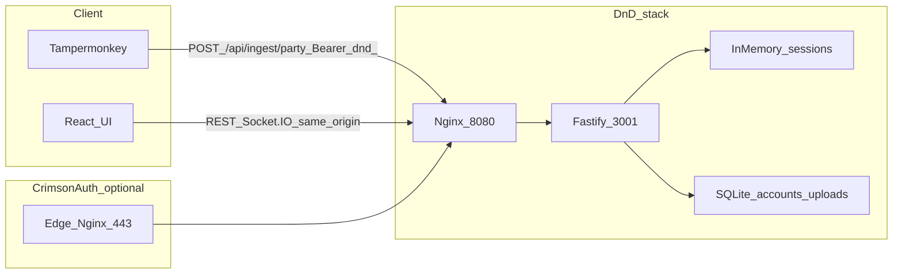

# Project canon — D&D Beyond DM Screen

This document is the **source of truth** for what the system is, how data moves, who may do what, and where it runs. Deeper technical detail lives in [ARCHITECTURE.md](./ARCHITECTURE.md); operations in [RUNBOOK.md](./RUNBOOK.md); threats and controls in [SECURITY.md](./SECURITY.md).

## Purpose

Self-hosted **table display** and **initiative tracker** that can incorporate **D&D Beyond** character data via unofficial JSON patterns and optional **browser-side** extraction (Tampermonkey). The app does **not** depend on a stable D&D Beyond public API or DOM contract.

## System boundaries

| Inside this product | Outside / upstream |
|--------------------|--------------------|
| Fastify API, SQLite (accounts + uploads), in-memory game sessions | D&D Beyond availability, ToS, URL and JSON shape changes |
| React UI, Socket.IO for live session sync | CrimsonAuth licensing API (separate codebase on same VPS optional) |
| User JWT, per-user API keys (`dnd_…`), DM/display session tokens | Cloudflare, DNS, Let’s Encrypt (edge stack) |

**Non-goals:** Scraping or locking to fragile D&D Beyond DOM selectors for core correctness; treating unofficial endpoints as a guaranteed contract.

## Layers (end to end)

1. **Ingest (client):** Tampermonkey (or similar) on `dndbeyond.com` builds a JSON payload and `POST`s to `/api/ingest/party` with `Authorization: Bearer dnd_<secret>`.
2. **API:** Validates payload, rate-limits per key, normalizes to a party snapshot, persists **latest** snapshot per user in SQLite (`user_ddb_uploads`).
3. **DB:** SQLite holds users, preferences (encrypted DDB cookie blob, layout, seed), API key hashes, and latest uploaded party. **Game sessions are not in SQLite** (in-memory).
4. **UI:** Browser uses JWT for account features; DM token for session mutations; display token for read-only table. After party data is loaded into a session, **Socket.IO** keeps DM console and TV display in sync for that session.

**Important:** Ingest does **not** automatically mutate an active game session. The DM explicitly **loads upload into this table** (`POST /api/sessions/:id/party/import-upload` with DM token + user JWT header).

## Data flow diagram

Production often terminates TLS at **CrimsonAuth** edge Nginx and proxies `dnd.saltbushlabs.com` to the DnD frontend on host port **8080** (see [RUNBOOK.md](./RUNBOOK.md)).

## Auth model

| Mechanism | Use | Notes |
|-----------|-----|--------|
| **User JWT** (HS256, `sub` = user id, ~30d) | Register/login UI; optional header on **New session**; required indirectly for import-upload | Stored in browser `localStorage`; signed with `AUTH_SECRET` |
| **API key** `dnd_…` | Tampermonkey → `POST /api/ingest/party` | Only prefix + hash stored; plain shown once at creation; max 10 keys per user |
| **DM token** | Mutate a specific game session | Opaque per session |
| **Display token** | Read-only session view (`/api/public/display/…`) | Opaque per session |

If `AUTH_SECRET` is unset or shorter than 32 characters, **accounts, API keys, and ingest are disabled** (ingest returns 503).

## Deployment model

- **Development:** Node 20+, npm workspaces — backend `:3001`, Vite `:5173` with proxy (see [README](../README.md)).
- **Docker (DnD repo):** `docker compose` builds backend + frontend; frontend nginx serves the SPA and proxies `/api` and `/socket.io` to the backend. Backend should bind to **127.0.0.1:3001** on the host in production so only the inner nginx exposes the API publicly.
- **Edge (optional, separate repo):** **CrimsonAuth** on a VPS provides Nginx vhosts and Let’s Encrypt; `dnd.saltbushlabs.com` proxies to `host.docker.internal:8080`. Authoritative TLS/nginx steps: CrimsonAuth repository `docs/deployment-runbook.md` (clone path on your server, e.g. `/opt/CrimsonAuth`).

## Persistence and risk (canon statements)

- **SQLite file:** Docker Compose bind-mounts **`./data` → `/app/data`** and sets **`DATABASE_PATH=/app/data/ddb-screen.db`** so accounts survive container recreate (see [RUNBOOK.md](./RUNBOOK.md)). Back up host `data/` for disaster recovery.
- **Game session state** is **in-memory**: backend restart clears all tables’ live combat/party/initiative until restored from uploads or DDB refresh.
- **Real-time:** Socket.IO provides live updates **within an active session**. There is **no** push from “new ingest” to the DM UI until the DM imports or refreshes.

## Related documents

- [ARCHITECTURE.md](./ARCHITECTURE.md) — components, schema, sequences
- [SECURITY.md](./SECURITY.md) — threat model, rate limiting, API key handling
- [RUNBOOK.md](./RUNBOOK.md) — Docker, volumes, updates, edge links
- [IMPLEMENTATION_TODO.md](./IMPLEMENTATION_TODO.md) — phased roadmap
- [PROJECT_PROGRESS.md](./PROJECT_PROGRESS.md) — chronological log (append-only)
- [ARCHITECTURE_SUMMARY.md](./ARCHITECTURE_SUMMARY.md) — short summary (legacy index)
- [DEPLOY.md](./DEPLOY.md) — deployment snippets (legacy; see RUNBOOK for full ops)
