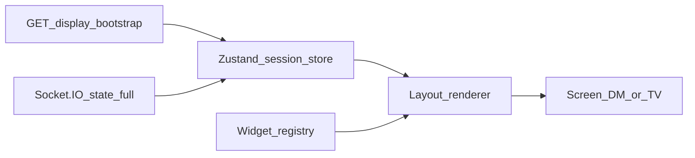

# UI platform architecture — TV-first fantasy dashboard

Companion to [PROJECT_CANON.md](./PROJECT_CANON.md) and [ARCHITECTURE.md](./ARCHITECTURE.md). This document defines how the **React frontend** evolves into a modular widget + layout system without changing backend authority over session state.

**Task backlog:** [UI_TODO.md](./UI_TODO.md) · **Progress log:** [UI_PROGRESS.md](./UI_PROGRESS.md) · **Tokens & themes:** [UI_DESIGN_SYSTEM.md](./UI_DESIGN_SYSTEM.md)

---

## 1. Current state (as implemented today)

### 1.1 Session consumption

| Surface | Boot | Live updates | Layout source |
|--------|------|--------------|---------------|
| **Table display** (`/display/:displayToken`) | `GET /api/public/display/:token` → `PublicSessionState` | Socket.IO `state:full` after `session:subscribe` | `state.tableLayout` via `TableLayoutView` |
| **DM console** (`/dm`) | No full-state REST bootstrap; waits for first `state:full` | Same hook | Main controls: hardcoded `lg:grid-cols-3`; **TV layout preview** uses same renderer as display |

Shared hook: `apps/frontend/src/hooks/useSessionSocket.ts`

- Connects with `sessionId` + token (DM or display); optional `{ uiMode: 'dm' | 'display' }` updates the runtime store.
- Pushes **`state:full`** into `apps/frontend/src/stores/sessionRuntimeStore.ts` (Zustand); display route uses **`hydrateDisplayBootstrap`** so REST boot does not overwrite a fresher socket snapshot for the same `sessionId`.
- Listens for **`state:full` only** (correct: server `broadcastSessionState` emits per-socket, role-filtered `PublicSessionState`).

Theme today: `document.documentElement` toggles `theme-minimal` / `theme-fantasy` from `state.theme` (`TableTheme` in `@ddb/shared-types`).

### 1.2 Layout rendering

`apps/frontend/src/layout/TableLayoutRenderer.tsx` (used by `TableLayoutView.tsx`):

- Reads `state.tableLayout.widgets`, sorts by `(y, x)` (`widgets/sortWidgets.ts`).
- Maps each `WidgetInstance` to CSS Grid placement: `gridColumn: x+1 span w`, `gridRow: y+1 span h` on a **12-column** track (`packages/shared-types/src/layout.ts` aligns with this).
- **Widget bodies** via `widgets/renderTableWidget.tsx` → **`WIDGET_REGISTRY`** (`widgets/widgetRegistry.ts`, `satisfies Record<WidgetType, …>`); unknown `type` → `UnknownWidget`.

Responsive rule (today): below `xl` (Tailwind `max-width: 1279px` in `index.css`), cells are forced to a single column — good for phones, **not** the primary TV path.

### 1.3 Gaps (target architecture must close)

| Gap | Risk | Direction |
|-----|------|-----------|
| ~~No widget registry~~ | — | **Done:** `widgetRegistry.ts` + `UnknownWidget` |
| DM layout editing | Blind edits vs TV | **Done:** `TableLayoutEditor` on `/dm` (Apply → `session:setTableLayout`) |
| ~~No global client store~~ | — | **Done:** `sessionRuntimeStore` (Zustand); socket + `hydrateDisplayBootstrap` |
| Theme = 2 enums + ad hoc CSS | Cannot ship “Dark Arcane / Parchment / Stone” cleanly | Token layers in [UI_DESIGN_SYSTEM.md](./UI_DESIGN_SYSTEM.md); extend `TableTheme` when backend agrees |
| ~~No debug overlay~~ | — | **Done:** Ctrl+Shift+D (see §7) |
| Partial WS events unused | Types list `party:updated` etc.; server sends `state:full` only | **Keep** consuming `state:full` only on client; partial events remain optional optimisation for later |

---

## 2. Target data flow (UI side)



**Rules:**

- Widgets **do not** call `fetch` / `apiGet` for session domain data; they receive props from the store (or a thin selector hook).
- **Mutations** stay on existing paths: DM console actions continue to use `emit(...)` and REST where they already do; after success, **server broadcast** refreshes the store via `state:full`.
- **Layout persistence** remains server-owned: `session:setTableLayout` + `parseTableLayoutPayload` (already in backend). Frontend never invents layout validation logic — send structures that match `TableLayout` / `WidgetInstance` from `@ddb/shared-types`.

---

## 3. Architecture options (evaluation)

### Option A — Registry + React context

- **Idea:** `SessionContext` holds `PublicSessionState`; `getWidget(type)` returns a component.
- **Pros:** Minimal new dependencies.
- **Cons:** Re-renders whole tree on any state change unless split carefully; no standard pattern for DM vs display selectors.

### Option B — Zustand store + widget registry (recommended)

- **Idea:** One store: `session`, `connected`, `uiMode` (`'dm' | 'display'`), `debugUi`. Socket subscriber calls `setSession` on `state:full`. Widgets use selectors (`useSessionStore(s => s.session.initiative)`).
- **Pros:** Matches requested stack; granular subscriptions; easy debug overlay and TV scale factor as UI state; testable without mounting sockets.
- **Cons:** Small learning curve; must avoid duplicating server logic in selectors (selectors are **read-only** projections).

### Option C — Route-level loaders + URL-synced layout

- **Idea:** Serialize layout in query params or hash for display URLs.
- **Pros:** Shareable layouts without session.
- **Cons:** Conflicts with canon (**layout lives on session**); duplicate source of truth. **Rejected.**

**Decision: Option B** — aligns with non-negotiable “central store”, “Socket → store → widgets”, and production-style evolution without second-guessing the session model.

---

## 4. Widget system design

### 4.1 Contract (conceptual)

All on-screen “slots” are **widget instances** (`WidgetInstance` from `@ddb/shared-types`):

- `id`, `type`, `x`, `y`, `w`, `h`, optional `config`, `themeOverride`.

Each **widget type** registers:

| Field | Purpose |
|-------|---------|
| `type` | `WidgetType` literal |
| `Component` | React component receiving **read-only** view props |
| `label` | For future layout editor palette |
| `emptyBehaviour` | `'hide' \| 'placeholder'` — today some widgets return `null` when empty |

**View props** (suggested shape; implement in Phase 2):

```ts
// Conceptual — live in apps/frontend when implemented
type WidgetViewProps = {
  instance: WidgetInstance;
  state: PublicSessionState;
  mode: 'display' | 'dm';
  tv?: boolean; // large type, focus-visible emphasis
};
```

### 4.2 Registration

- Single module `widgetRegistry.ts`: `Record<WidgetType, WidgetDefinition>` built with **`satisfies` or exhaustiveness** so new `WidgetType` in shared-types forces a frontend compile error.
- **Forbidden:** parallel string unions or magic widget IDs not in `WidgetType`.

### 4.3 File layout (suggested)

```
apps/frontend/src/
  widgets/
    registry.ts
    types.ts
    PartyWidget.tsx
    InitiativeWidget.tsx
    TimedEffectsWidget.tsx
    DiceLogWidget.tsx
    ClockWidget.tsx
    SpacerWidget.tsx
  layout/
    TableLayoutRenderer.tsx   # successor name for TableLayoutView if split
```

---

## 5. Layout renderer design

### 5.1 Mapping `tableLayout` → DOM

Unchanged conceptually from today:

- Container: CSS `display: grid`; `grid-template-columns: repeat(12, minmax(0, 1fr))`.
- Each widget: `grid-column: (x+1) / span w`, `grid-row: (y+1) / span h`.

### 5.2 Server contract

- Backend validates with `parseTableLayoutPayload` (`apps/backend/src/util/table-layout.ts`).
- Frontend must not assume rows are dense: **explicit row indices** as today; future editor may compact or insert gaps — server remains authoritative.

### 5.3 TV vs narrow viewports

- **TV (primary):** fixed 12-column semantic grid; optional `clamp()`-based gaps from [UI_DESIGN_SYSTEM.md](./UI_DESIGN_SYSTEM.md).
- **Narrow:** keep stack behaviour, or introduce a **“display profile”** in UI state (not session) to force desktop grid in kiosk mode if needed later.

---

## 6. DM vs display mode

| Concern | Display | DM |
|---------|---------|-----|
| `PublicSessionState` | Full minus `npcTemplates` / `dmOnly` log lines | Full including DM fields |
| Layout preview | Exact `TableLayoutView` output | Same component, `mode="dm"` for future chrome |
| Controls | None on TV surface | Existing console panels; eventually **layout editor** sidecar |

---

## 7. Debug overlay (spec)

Toggle (keyboard: e.g. `` ` `` or `Ctrl+Shift+D` — final choice in implementation):

When **on**:

1. **Widget bounds** — outline each `.table-layout-cell` / widget root with semi-transparent border; show `widget.id` + `type` in corner.
2. **Grid** — overlay 12 column guides (only in TV breakpoint).
3. **Raw session** — collapsible panel or monospace overlay: `JSON.stringify(session, null, 2)` with redaction optional later.

Implementation note: debug flags live in **Zustand UI slice** or `sessionStorage` persistence — not in `PublicSessionState`.

---

## 8. Theme system (frontend responsibilities)

- **Today:** `TableTheme = 'minimal' | 'fantasy'` on session; CSS classes on `:root`.
- **Target:** design tokens per theme in CSS variables ([UI_DESIGN_SYSTEM.md](./UI_DESIGN_SYSTEM.md)); runtime switch by class on `document.documentElement` or a wrapper.
- **Future per-session themes** beyond enum require **shared-types + backend** agreement — document in IMPLEMENTATION_TODO when ready; UI layer only **consumes** `theme` and optional `widget.themeOverride`.

---

## 9. TV mode (10-foot UX)

Principles:

- **Type scale:** base body ≥ 18–22px equivalent on TV routes; headings scale with modular scale in design system.
- **Focus:** all interactive targets keyboard-focusable with visible `focus-visible` rings (no hover-only affordances).
- **Hit targets:** min 44×48px where controls exist.
- **Performance:** memoise heavy lists (party cards); avoid inline anonymous components in hot paths after registry split.

---

## 10. Success criteria (UI platform)

- Table display renders **only** from `tableLayout` + `PublicSessionState` (already true; preserve).
- New widget type = **shared-types** + **`WIDGET_REGISTRY` entry** + **component file** — layout renderer stays generic dispatch only.
- DM can **see** the same layout as TV (preview) before drag/drop ships.
- Themes switch without flash of wrong tokens (class applied before paint where possible).

---

## Related code references

- Types: `packages/shared-types/src/layout.ts`, `session.ts`, `ws-events.ts`
- Layout UI: `apps/frontend/src/layout/TableLayoutRenderer.tsx`, `apps/frontend/src/components/TableLayoutView.tsx`
- Widgets: `apps/frontend/src/widgets/` (`widgetRegistry.ts`, `renderTableWidget.tsx`)
- Runtime store: `apps/frontend/src/stores/sessionRuntimeStore.ts`
- Socket hook: `apps/frontend/src/hooks/useSessionSocket.ts`
- Global UI hotkeys: `apps/frontend/src/components/SessionRuntimeHotkeys.tsx`
- Display page: `apps/frontend/src/pages/TableScreen.tsx`
- DM console: `apps/frontend/src/pages/DmConsole.tsx`
